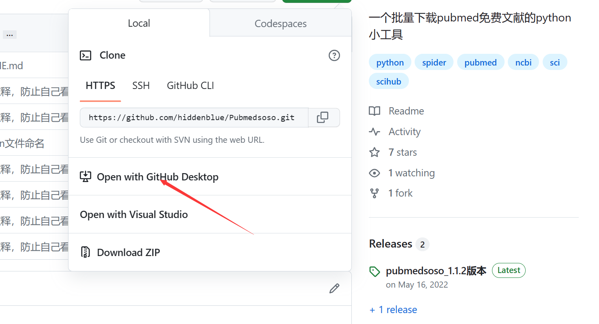
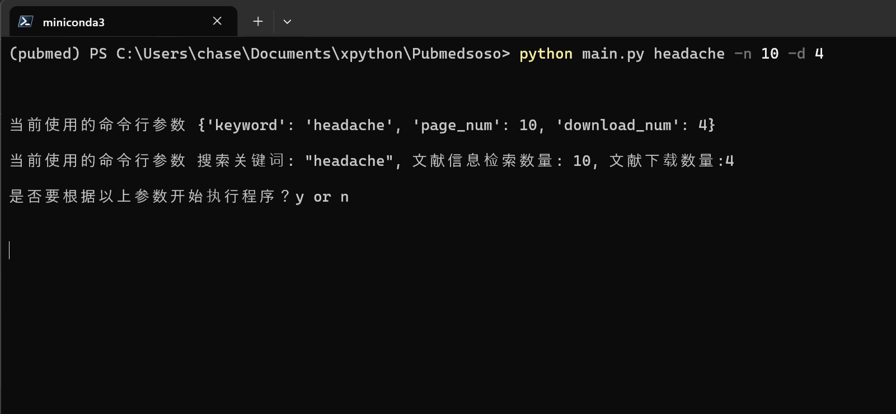
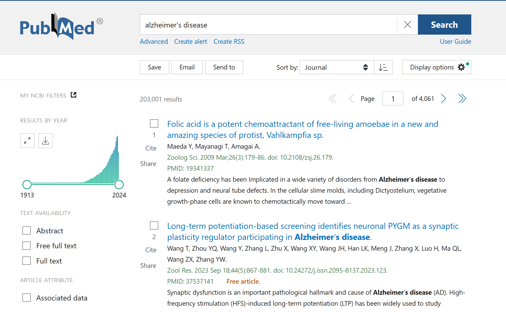
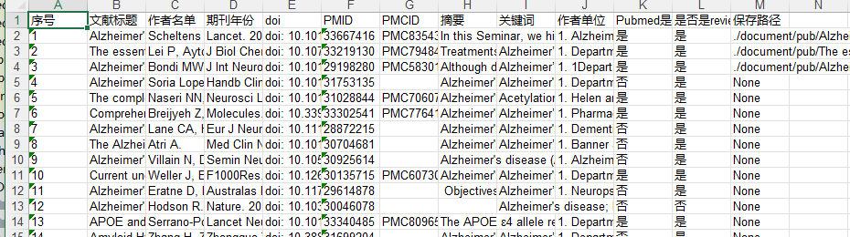
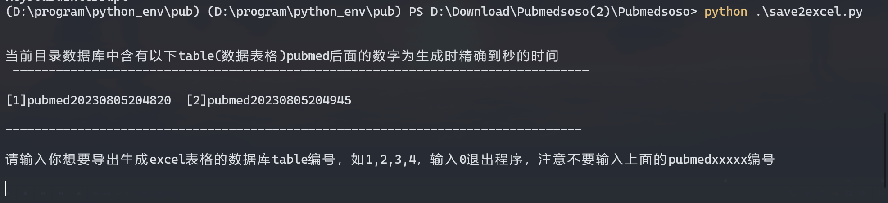

= Pubmedsoso =
:toc:

一个自动批量提取pubmed文献信息和下载免费文献的小工具

== 主要功能 ==

自己写的基于 [.line-through]#bs4和urllib# requests pandas和xpath 的pubmed文献信息爬取和下载的工具，按照你给定的参数，按你的要求获取相关的文献信息，并且下载对应文献的PDF原文

下载速度大概是10s一篇，同时能够提取文献的大部分信息，并自动生成excel文件，包括文献标题，摘要，关键词，作者名单，作者单位，是否免费，是不是review类型等信息。自动下载后，会将部分信息储存在本地的文本文件中，供参考，检索数据会储存在sqlite3数据库中，最后执行完成后，自动导出所有信息，生成一个Excel文件。

== 依赖模块 ==

* 主要使用了requests, pandas, xpath

* 项目页面右边的Release当中有Nuitka打包成的exe执行文件，自带所有依赖，可以直接下载后在windows下命令行执行使用。

* 如果需要自己在python环境运行请根据requirements.txt文件安装对应的依赖

[source, bash, indent=2]
----
include::requirements.txt[]
----

== 使用方法 ==

. 克隆项目，在命令行环境下安装项目所需的依赖文件

[source, bash]
----
git clone https://github.com/hiddenblue/Pubmedsoso.git
cd Pubmedsoso
pip install -r requirements.txt
----

当然，不方便安装git工具的话，直接直接下载Release当中的ZIP解压执行

. 在Windows terminal中切换到项目文件夹,执行 `python main.py` 带上关键词参数 或者在直接执行exe可执行文件 `pubmedsoso.exe` + 关键词

比如
[souce, bash]
----
python main.py headache -n 5 -d 10
----

`headache` 参数是此次运行输入的检索关键词

`-n` 参数后面数字指的是需要检索的页数， 每页会有50篇

`-d` 参数后面表示需要下载的文献的份数

`-y` 参数后面表示你想检索的信息的年份范围，以年为单位,比如 -y 5表示近五年的文献

* 输入页数时，每页会检索50个，数字不用设置得太大，否则需要较长时间执行

* 然后输入需要下载的文献数量，程序会从搜索结果中找到free pmc 免费文献，自动下载，这里下载速度取决你的网络状况。

* 每个文献下载超过30s自动超时跳过，下载下一个。

[source, bash]
----
PS C:\Users\chase\Documents\xpython\Pubmedsoso> python main.py --help

usage: python main.py keyword
pubmedsoso is python program for crawler article information and download pdf file

positional arguments:
keyword               specify the keywords to search pubmed For example "headache"

optional arguments:
--help,     -h      show this help message and exit
--version,  -v      use --version to show the version
--page_num, -n      add --number or -n to specify the page number to 
--year      -y      add --year or -y to specify year scale you would to 
--download_num, -d  add --download_num or -d to specify the number to download

----

_如果你熟悉IDE的话，可以在pycharm或者vscode等python环境下运行main.py_

. 根据提示输入 `y` 或者 `n` 决定是否以给定的参数执行程序

**pubmedsoso会按照你正常搜索的顺序进行爬取下载**

. 文献会自动下载到之前说的"document/pub/"下，同时会生成原始遍历信息的txt文件，程序最终执行完成会生成excel文件。

请大家不要太过分的去爬取Pubmed。

== ExcelHelper 模块 ==

这个是方便大家在爬取之后，将历史信息导出到excel的模块，可以单独执行。比如在IDE或者命令行中执行 `python ExcelHelper.py`

出现如上提示，可以选择sqlite3数据中的历史记录进行导出，会自动在本地生成一个导出的文件。**不能有重复命名的excel文件，需要按提示删除**

== TO DO List ==

* [ ] 精确地搜索下载，这个还有点难
* [x] 自定义关键词下载，这个未来应该会做，等我有空弄明白pubmed的检索参数url生成规则就行（已经实现）
* [ ] 对非免费文献的scihub自动补全下载
* [ ] 能用的gui界面
* [ ] 最好附带一个免费的百度翻译插件，有时候大家可能用得上
* [x] 采用OOP和更加现代化的工具重构项目（进行ing）
* [ ] 使用异步的方式重构代码，提高执行的效率

'''

    2022.5.16 更新
    更新了自动创建document/pub文件夹功能，不需要手动创建文件夹了，会自动检查和创建。

    2023.08.05 更新 
    更新修复了abstract爬取失败的bug，同时不再需要用户手动复制粘贴网页的参数了。

    2024.11.23 更新
    作者竟然想起了这个黑历史一般的项目，偷偷更新一下，“这TM是我写的代码? 怎么这么烂" 