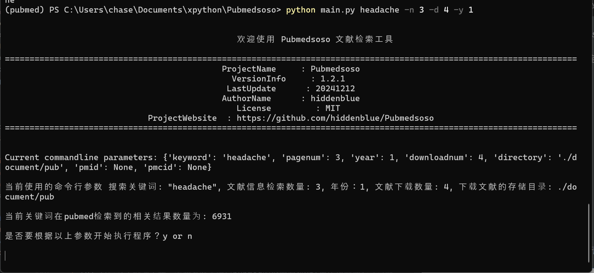

= Pubmedsoso =
:toc:

*Language*: link:README.adoc[English] | link:README_CN.adoc[简体中文]

image:assets/icon.png[Pubmedsoso]

A small tool for automatically extracting PubMed literature information and downloading free literature in bulk.

== Features ==
A tool for crawling and downloading PubMed literature information, written based on `aiohttp`, `pandas`, and `xpath`. It retrieves relevant literature information according to the parameters you provide and downloads the corresponding PDF originals.

The download speed is approximately 1 second per article. It can extract most of the literature information and automatically generate an Excel file, including details such as the title, abstract, keywords, author list, author affiliations, whether it is free, and whether it is a review type.

After automatic downloading, some information is stored in local text files for reference, and search data is stored in an `sqlite3` database. Finally, after execution, all information is automatically exported and an Excel file is generated.

== Dependencies ==
_Based on Python 3.9, also supports higher versions. Mainly uses `pandas`, `xpath`, `asyncio`, `aiohttp`._

On the project page, there is an executable file packed with `Nuitka` in the Releases section, which includes all dependencies and can be directly downloaded and executed in the Windows command line.

_If you need to run it in a Python environment, please install the corresponding dependencies according to the `requirements.txt` file._

[source, bash, indent=2]
----
asyncio~=3.4.3
aiohttp~=3.11.8
requests~=2.32.3
lxml~=5.3.0
pandas~=2.2.3
openpyxl~=3.1.5
----

== Usage ==
. Clone the project and install the required dependencies in the command line environment. It is recommended to use Python virtual environment tools such as `anaconda` or `miniconda3`.

[source, bash]
----
git clone https://github.com/hiddenblue/Pubmedsoso.git
cd Pubmedsoso
pip install -r requirements.txt
----

If it is inconvenient to install the `git` tool, you can directly download the ZIP file from the Releases section on the right side of the page and unzip it for execution.

. Switch to the project folder in the terminal and execute `python main.py` with keyword parameters, or directly execute the executable file `pubmedsoso.exe` + keywords. For example:

[source, bash]
----
python main.py headache -n 5 -d 10
----

`headache` is the search keyword (keyword) input for this run. If your keyword contains spaces, please enclose the keyword with double quotes. It supports PubMed advanced query boxes, such as "headache AND toothache", which include logical expressions like AND, NOT, OR.

`-n` parameter followed by a number specifies the number of pages to search, with 50 articles per page.

`-d` parameter followed by a number specifies the number of articles to download.

`-y` optional parameter followed by a number specifies the year range for the information you want to search, in years. For example, -y 5 means literature from the last five years.

When entering the number of pages, each page contains 50 search results. There is no need to set a large number, otherwise, it will take a long time to execute.

Then enter the number of articles you need to download. The program will find free PMC articles from the search results and download them automatically. The download speed depends on your network condition. Each article download will automatically timeout and skip after 30 seconds, downloading the next one.

[source, bash]
----
PS > python main.py --help
usage: python main.py keyword
pubmedsoso is a python program for crawling article information and downloading pdf file

positional arguments:
  keyword               specify the keywords to search pubmed e.g. "headache"

optional arguments:
  --help,       -h    show this help message and exit
  --version,    -v    use --version to show the version
  --pagenum,    -n    add --pagenum or -n to specify the page number to
  --year        -y    add --year or -y to specify year scale you would to
  --downloadnum,-d    a digit number to  specify the number to download
  --directory   -D    use a valid directory path specify the pdf save directory.
----

_If you are familiar with IDEs, you can run `main.py` in Python environments such as `pycharm` or `vscode`._

. According to the prompts, input `y` or `n` to decide whether to execute the program with the given parameters.

**pubmedsoso will crawl and download according to the normal search order.**

image:assets/pic_keyword.png[Pubmedsoso, 600]

. The literature will be automatically downloaded to the "document/pub/" folder mentioned earlier, and a txt file with the original traversal information will be generated. The program will finally generate an Excel file after execution.

image::assets/pic_result.png[Pubmedsoso, 600]

WARNING:: Please do not excessively crawl the PubMed website. Since this project uses asynchronous mechanisms, it has high concurrency capabilities. Parameters related to access speed can be set in `config.py`, and the default values are not too large.

== ExcelHelper Module ==
This module is convenient for exporting historical information to Excel after crawling. It can be executed separately, such as in an IDE or command line, by executing `python ExcelHelper.py`.

When the above prompt appears, you can choose to export historical records from the `sqlite3` data and an exported file will be automatically generated locally. **Duplicate-named Excel files are not allowed and need to be deleted as prompted.**

== TO DO List ==
* [ ] Precise search and download, this is still a bit difficult_

* [x] Custom keyword download, waiting for me to figure out the PubMed search parameter URL generation rules (already implemented)
* [ ] Automatic completion of non-free literature download via SciHub, perhaps allowing users to write adapters themselves_
* [ ] A usable GUI interface_
* [ ] Ideally, a free Baidu translation plugin, sometimes it might be useful_
* [x] Refactor the project using OOP and more modern tools
* [x] Refactor the code using asynchronous methods to improve execution efficiency
* [ ] A potentially necessary logging system_
* [ ] Implement an active literature subscription feature based on email subscription and push mechanism, pushing the latest literature to users

== Debugging Guide ==
Due to the specificity of the `asyncio` asynchronous module, some special issues may occur during debugging on Windows.

If you need to develop and debug the code, you need to modify two places:

In `GetSearchResult.py`:

[source, bash]
----
try:
    if platform.system() == "Windows":
        asyncio.set_event_loop_policy(asyncio.WindowsSelectorEventLoopPolicy())
    html_list = asyncio.run(WebHelper.getSearchHtmlAsync(param_list))
----

If debugging on Windows, please comment out the conditional execution statement above, otherwise, it will take effect during debugging and cause errors.

Additionally, `asyncio.run()` is used in multiple places in the project. During debugging, the debug parameter needs to be enabled, otherwise, the runtime will get stuck and report a `TypeError: 'Task' object is not callable` error.

== Update Log ==
2022.5.16 Updated the feature to automatically create the `document/pub` folder, no need to manually create the folder, it will automatically check and create.

2023.08.05 Updated to fix the bug where abstract crawling failed, and no longer requires users to manually copy and paste web parameters.

2024.11.23 The author unexpectedly remembered this somewhat embarrassing project and quietly updated it, "Is this really the code I wrote? How could it be so bad?"

2024.12.02 Refactored the entire code based on OOP, `xpath`, and `asyncio` asynchronous, removed the runtime speed limit, the speed is about 100 times the original, "Writing this was so exhausting."